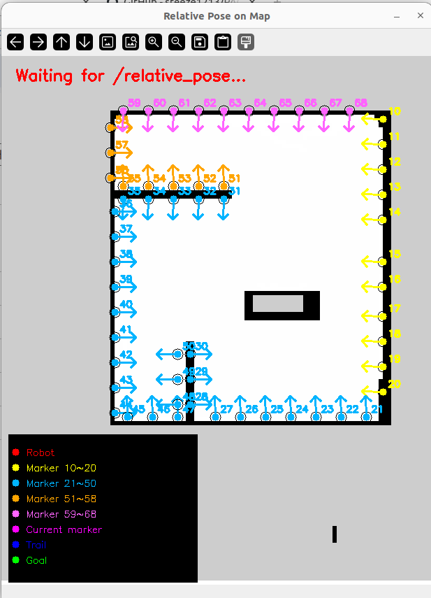

# PACK — 군집 협업 자율 피킹·운반 로봇
**융합\_로보테크 AI 자율주행로봇 개발자 과정 2기 최종 프로젝트 (팀 PACK / 4조)**

> 리더 로봇이 물건을 인식·정밀 정렬해 로봇팔로 집고, 뒤따르는 군집 추종 차량(F1 -> F2)이 이를 이어받아 운반하는 다중 로봇 협업 시스템

---

## 프로젝트 개요

| 항목 | 내용 |
|------|------|
| **프로젝트명** | PACK (Pick · Arm · Carry Kit) |
| **팀 구성** | 4명 (팀 PACK / 4조) |
| **목표** | 리더의 자동 피킹 + 군집 추종 운반을 결합한 협업 자율 로봇 |
| **구성** | 로봇팔 서브시스템 + 추종 차량 서브시스템 |
| **개발 환경** | Ubuntu 22.04, ROS2 Humble, Arduino, Raspberry Pi |

산업 현장의 피킹/운반 과정을 다중 로봇이 분담하는 시나리오를 목표로 한다. **리더(TurtleBot3 Waffle Pi)** 는 상단에 6자유도 로봇팔을 얹어 카메라로 물건을 인식하고 자동으로 집어 후면에 적재한다. **추종 차량(F1, F2)** 은 앞 차량 후면의 ArUco 마커와 맵 기반 위치추정으로 일정 간격을 유지하며 줄지어 따라온다.

기존 고정형 피킹 설비와 달리, **이동하는 리더가 직접 물건을 집고 군집이 이를 이어받아 운반**한다는 점, 그리고 단일 로봇이 아닌 **다중 로봇의 역할 분담 협업**이라는 점이 차별점이다.

---

## 시스템 구성

| 계층 | 구성요소 | 역할 |
|------|---------|------|
| 로봇팔 두뇌 | Arduino Uno + PCA9685 | 서보 6채널 PWM 제어, 안전범위/충돌가드/긴급정지 |
| 로봇팔 제어 | Raspberry Pi + MQTT 게이트웨이 | MQTT 명령을 USB 시리얼로 중계 (무선 제어) |
| 리더 비전 | Pi Camera (eye-in-hand) + OpenCV | 색검출(HSV) / ArUco 마커 인식, 정밀 주차 |
| 추종 차량 | Arduino 4WD + 쿼드러처 엔코더 | 전진/커브/제자리회전 주행, 엔코더 틱 발행 |
| 추종 측위 | ROS2 + OpenCV solvePnP | 마커 맵 PnP + 엔코더 오도메트리 융합 위치추정 |
| 추종 제어 | ROS2 추종 FSM | 마커 우선 + 맵 보조로 간격 유지 군집 주행 |
| 통신 | Mosquitto MQTT / Serial | 노드 ↔ 펌웨어 ↔ 상위 제어 메시지 중계 |

```
[리더] 카메라 -> 색검출/ArUco -> auto_pick/visual_pick -> MQTT -> 게이트웨이 -> 아두이노 -> 서보
                                          park.py -> /cmd_vel -> OpenCR -> 바퀴
[추종] 카메라 -> aruco_node(PnP) -> relative_pose(엔코더 융합) -> follow_node(FSM) -> /robot_cmd -> 4WD
   앞차 후면 마커(ID98/97) 추적 + 맵 위치추정 병행
```

---

## 팀 구성 및 역할 분담

| 팀원 | 주 담당 | 함께 기여 |
|------|---------|----------|
| **윤우영** | 추종 차량 전반 — 4WD 펌웨어, ArUco 맵 측위(PnP), 추종 제어 FSM, 웨이포인트/SLAM | 통합 시나리오 설계 |
| **길민준** | 로봇팔 전반 — 펌웨어, MQTT 무선제어, 자동 피킹, 정밀 주차, 비주얼 서보잉 | 카메라 측위 연동 |
| **김아영** | 비전 — ArUco 인식·카메라 캘리브레이션, 마커 맵 배치, 색검출(eye-in-hand) | 자동 피킹 동작 튜닝 |
| **안효민** | 통신·통합 — MQTT/시리얼 브리지, 엔코더 오도메트리, 테스트·캘리브레이션, 문서화 | 군집 추종 검증 |

---

## 1. 로봇팔 서브시스템

> 6DOF 로봇팔을 MQTT로 무선 제어하고, 카메라로 물건을 인식해 자동으로 집어 후면에 적재한다

### 프로젝트 주제

서보 6개(FT330M 35kg ×3, MG996R ×3)로 구성된 6자유도 로봇팔을 라즈베리파이가 **MQTT -> USB 시리얼 게이트웨이**로 무선 제어한다. 펌웨어에 각도→펄스 변환, 채널별 안전범위 클램프, 순운동학(FK) 기반 충돌가드, 긴급정지를 내장했고, 상위 파이썬이 3물건 자동 피킹과 ArUco 정밀 주차를 담당한다. 현재는 집게 안쪽에 카메라를 단 **eye-in-hand 비주얼 서보잉**으로 전환을 시도 중이다.

### 기능적 요소

**펌웨어 (RobotArmCase.ino)**
- 각도 -> 펄스(us) -> 틱(50Hz) 변환으로 6채널 서보 제어
- 채널별 안전 각도범위 자동 클램프 (서보 2종 혼용 대응)
- FK 충돌가드: 집게끝이 베이스 반경 진입 시 자동 정지
- 긴급정지(EMS) 및 부팅 시 자동 홈 보정

**자동 피킹 (auto_pick.py)**
- 좌/중/우 3물건을 베이스 회전각으로 조준 -> 하강 -> 파지 -> 후면 적재
- 단일 물건 / 연속(ALL) 모드 지원
- 그리퍼 교체 후 파지값 재캘리브레이션 (닫기 20, 손목 150)

**비전 피킹 (color_detect.py / visual_pick.py)**
- 주황 물건 HSV 색검출, 16Hz 안정 동작
- 색 블롭 중심(cx)을 베이스 회전으로 정렬 후 파지 (eye-in-hand)

**무선 제어 (mqtt_gateway_lite.py)**
- MQTT 토픽(`pack/arm/cmd`)을 USB 시리얼 명령으로 중계

### 활용 기술 및 도구

| 구분 | 내용 |
|------|------|
| **MCU** | Arduino Uno, PCA9685 (I2C 16채널 PWM) |
| **구동** | FT330M 35kg ×3, MG996R ×3 서보 (6DOF) |
| **제어** | Raspberry Pi, ROS2 Humble (camera_ros, cv_bridge) |
| **비전** | OpenCV (ArUco, HSV 색검출), Pi Camera v2 (imx219) |
| **통신** | Mosquitto MQTT, USB Serial |
| **수학** | 순운동학(FK) 충돌가드, 각도-펄스 매핑 |

### 진행 현황

| 파트 | 진척도 | 비고 |
|------|:---:|------|
| 펌웨어 + MQTT 무선제어 | 95% | 안정 동작 |
| 3물건 자동 피킹 | 90% | 검증 완료 |
| ArUco 정밀 주차 | 60% | step&measure 2회 성공, 안정화 필요 |
| eye-in-hand 비전 피킹 | 50% | 자세 재설계 진행 중 |

### 힘들었던 점 및 아쉬웠던 점

- 서보 2종(35kg/MG996R) 토크 차이로 채널별 속도·범위 튜닝에 시간 소요
- 이동 중 들어온 명령을 펌웨어가 무시해, 상위에서 대기시간을 충분히 확보해야 했음
- eye-in-hand 카메라가 수평을 봐 대기자세에서 물건이 화면에 안 잡히는 구조적 한계 발견
- 주차 코드 종료 시 속도 명령이 잔류해 안전사고 위험 (watchdog 보완 필요)

---

## 2. 추종 차량 서브시스템

> ArUco 맵 측위와 엔코더 오도메트리를 융합해, 앞 차량을 일정 간격으로 줄지어 따라간다

### 프로젝트 주제

4WD 아두이노 차량(쿼드러처 엔코더)이 ROS2(Humble)로 동작한다. 벽면에 부착한 **50여 개 ArUco 마커 맵**을 `solvePnP` 멀티마커로 풀어 절대 위치를 얻고, 마커가 안 보일 때는 **엔코더 오도메트리**로 추측항법한다. 앞 차량 후면의 마커(ID 98/97)와 맵 위치를 함께 활용해 **펄스 기반 추종 FSM**으로 간격(0.27~0.33m)을 유지하며 TurtleBot 리더 -> F1 -> F2 순으로 줄지어 따라온다.

> ⚠️ **이전 작업 자료**: 아래 마커 맵 이미지와 `map_pose_viewer_pc.py`, `encoder_bridge_f1/config/aruco_reference.yaml`은 **이전 마커 배치 기준**이다. 이후 맵의 ArUco 마커를 전면 교체·재배치했으므로, 현재 운영 중인 마커 위치/방향(ID·좌표)과는 다르다. 측위·추종 로직 자체는 동일하게 유효하다.

<p align="center">
  
  <br><sub>SLAM 맵 위 ArUco 마커(ID 10~68) 부착 위치·방향 시각화 — map_pose_viewer_pc.py (이전 마커 배치 기준)</sub>
</p>

### 기능적 요소

**4WD 차량 펌웨어 (f1_car.ino)**
- 핀체인지 인터럽트 기반 쿼드러처 엔코더 카운트
- 전진 / 좌우 커브 / 제자리회전(true pivot) 주행 모드
- 출발 시 후륜 킥으로 정지마찰 극복, `ENC,...` 시리얼 송신

**ArUco 맵 측위 (aruco_node.py / relative_pose_node.py)**
- 다단계 마커 검출 (NORMAL -> CLAHE -> SHARP)
- 멀티마커 solvePnP + 단일마커 range-bearing 보정
- 재투영오차 기반 이상치 제거, 마커 개수별 신뢰도 가중 융합
- 안정 초기화 + 큰 점프 시 안전 재측위(relocalize)

**엔코더 오도메트리 융합 (encoder_odom_node.py / serial_encoder_node.py)**
- 차동구동 적분 (둘레 0.21m, 트랙 0.23m, 3600 cnt/rev)
- 비정상 틱 점프 필터링, 마커 미검출 구간 보조 측위

**군집 추종 제어 (turtlebot_to_f1 / f1_to_f2_follow_node.py)**
- 마커 우선 / 맵(AMCL) 보조 추종 FSM
- 목표 간격 유지, 마커·맵 타임아웃 시 자동 정지(안전)

**웨이포인트 주행 / SLAM (waypoint_drive_node.py / maps)**
- 목표점 주행 + 마커 기반 복구 탐색
- SLAM 맵(해상도 0.05) 기반 측위

**맵·위치 모니터링 GUI (map_pose_viewer_pc.py)**
- SLAM 맵 위에 ArUco 마커(10~68) 위치·방향과 로봇 실시간 위치·궤적 오버레이
- 마우스 클릭으로 목표점(`/goal_pose`) 지정, 위치 점프(이상치) 시 시각 경고
- *(위 이미지가 이 도구의 실행 화면 — 단, 마커 배치는 이전 버전 기준)*

### 활용 기술 및 도구

| 구분 | 내용 |
|------|------|
| **차량** | Arduino 4WD (AFMotor), 쿼드러처 엔코더 ×2 |
| **OS / 미들웨어** | Ubuntu 22.04, ROS2 Humble, rclpy |
| **측위** | OpenCV solvePnP, ArUco 마커 맵(50+), 엔코더 오도메트리 |
| **주행** | 추종 FSM, 웨이포인트, Nav2 / AMCL / SLAM 맵 |
| **통신** | Serial (ENC/CMD 프로토콜), ROS2 토픽 |
| **시각화** | OpenCV GUI 맵 뷰어 (마커·포즈·궤적 표시, 목표점 클릭 지정) |
| **설정** | YAML (마커맵, 카메라 캘리브레이션) |

### 진행 현황

| 파트 | 진척도 | 비고 |
|------|:---:|------|
| 4WD 차량 펌웨어 | 90% | 안정 동작 |
| ArUco 맵 측위 (PnP) | 85% | 멀티마커 융합 |
| 엔코더 오도메트리 융합 | 85% | 마커 보조 측위 |
| 군집 추종 제어 | 75% | 기본 동작 검증 |
| 웨이포인트 / SLAM | 70% | Nav 연동 |

### 힘들었던 점 및 아쉬웠던 점

- 마커 다수를 동시에 풀 때 PnP 이상치가 위치를 튀게 해, 재투영오차·신뢰도 가중 필터링을 여러 차례 보강
- 마커 미검출 구간에서 엔코더 누적 오차가 커져, 점프 필터와 안전 재측위 로직이 필요했음
- 펄스 기반 추종이라 간격 유지 파라미터(펄스 길이·정지 텀) 튜닝에 시간 소요
- 좌우 모터 특성 차이로 직진성 보정값을 개별 튜닝해야 했음

---

## 디렉토리 구조

```bash
PACK/
├── README.md
├── RobotArmCase.ino            # 로봇팔 펌웨어 (Arduino Uno)
├── auto_pick.py                # 3물건 자동 피킹
├── mqtt_gateway_lite.py        # MQTT -> USB 시리얼 게이트웨이
├── f1_car.ino                  # 추종 4WD 차량 펌웨어 (엔코더)
├── map_pose_viewer_pc.py       # 맵·위치 모니터링 GUI (이전 마커 배치 기준)
├── 로봇팔 켈리브래이션.docx      # 로봇팔 캘리브레이션 자료
├── images/                     # 문서용 이미지 (마커 맵 캡쳐 등)
└── encoder_bridge_f1/          # 추종 차량 ROS2 패키지
    ├── encoder_bridge/         # aruco / relative_pose / encoder_odom /
    │                           #  serial_encoder / *_follow / waypoint_drive 노드
    ├── launch/                 # f1_follow / f2_follow / robot_follow 시스템 런치
    ├── config/                 # aruco_reference.yaml(마커맵, 이전 배치), camera_calibration.yaml
    └── maps/                   # SLAM 맵 (map_cleaned)
```

---

## 실행 방법

**로봇팔 (Raspberry Pi)**
```bash
python3 mqtt_gateway_lite.py <arduino_by-id_port> localhost   # 게이트웨이
python3 auto_pick.py ALL                                       # 자동 피킹 전체
# 단일 명령: mosquitto_pub -t pack/arm/cmd -m "13 90"
```

**추종 차량 (ROS2 Humble)**
```bash
colcon build --packages-select encoder_bridge && source install/setup.bash
ros2 launch encoder_bridge f1_follow_system.launch.py          # F1: 리더 추종
ros2 launch encoder_bridge f2_follow_system.launch.py          # F2: F1 추종
ros2 topic pub --once /f1/follow_enable std_msgs/String "{data: 'start'}"
```

---

## 기술적 개선 가능성

- 리더 -> 추종 -> 피킹 **전체 통합 시나리오** 연동 및 현장 검증
- 로봇팔 eye-in-hand 비주얼 서보잉 완성 (카메라 시야 기준 자세 재설계)
- 정밀 주차 안정화 (step&measure 복원 + 종료 watchdog)
- 다중 추종 차량 확장 (F2 이상) 및 적재/하역 자동화

---

*로보테크 AI 4조 — 윤우영 · 길민준 · 김아영 · 안효민*
